# About

Communication today is rife with third party interference.
From censorship and deplatforming, to rent seeking intermediaries, to the misuse of data in the surveillance economy.

Waku is designed to place control of communication back into the hands of the individual.

## Motivation and goals

### Privacy

These applications have a desire for some privacy guarantees, such as pseudonymity, metadata protection in transit, etc.

### Peer-to-Peer

These applications sometimes have requirements that make them suitable for peer-to-peer solutions.

### Generalized messaging

Many applications require some form of messaging protocol to communicate between different subsystems or different nodes.
This messaging can be human-to-human or machine-to-machine or a mix.

### Resource restricted

These applications often run in constrained environments,
where resources or the environment is restricted in some fashion.
E.g.:

- limited bandwidth, CPU, memory, disk, battery, etc.,
- not being publicly connectable,
- only being intermittently connected; mostly-offline.

## History

Waku v1 was a fork of Whisper with some added tweaks for efficiency.
Waku v2 is a completely redesigned suite of protocols designed to address the goals set out above.

```mermaid
%%{init: { 'logLevel': 'debug', 'theme': 'base', 'gitGraph': {'showBranches': true, 'showCommitLabel':true,'mainBranchName': 'HISTORY'}} }%%
    gitGraph
      commit id:"2013"
      commit id:"2015" tag:"R&D"
      commit id:"2018" tag:"R&D" type: HIGHLIGHT
      branch v1
      checkout v1
      commit id:"2020" tag:"release"
      checkout HISTORY
      merge v1
      branch v2
      checkout v2
      commit id:"2021" tag:"release"
      checkout HISTORY
      merge v2
      commit id:"🔥"

```

### 2013

Ethereum White Paper was introduced with the Holy Trinity,
consisting of Ethereum for consensus, Swarm for decentralized storage, and Whisper for p2p messaging.

### 2015-2018

R&D of Whisper was slow to follow progress of the Ethereum EVM and Swarm without a dedicated team building out the protocol.

### 2018

With little progress made on Whisper and significant scalability concerns growing,
Vac was formed to conduct R&D on more scalable p2p messaging.

### 2020

Waku v1 was introduced as the messaging protocol in Status, replacing Whisper.

### 2021

Waku v2 replaces Waku v1.
